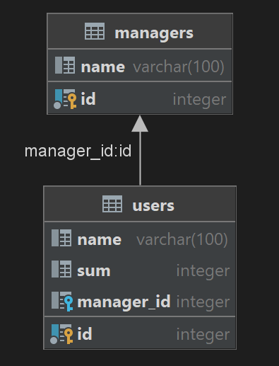

Lesson 35 homework ( SQL topic )

Programm test CODE:

        
        public static void main(String[] args) {
            System.out.println("Lesson 35, SQL");
            System.out.println("Homework");
    
            Homework35 homework35 =new Homework35();
            homework35.recreateTables();
            homework35.fillTables();
            homework35.print();
            homework35.printMoneyByManagers();
            System.out.println("Add Carolina and Monica users and print DATA");
            homework35.addUser("Carolina",9000,4);
            homework35.addUser("Monica",5000,5);
            homework35.printMoneyByManagers();
            System.out.println("Change Monica sum and print DATA");
            homework35.userUpdateSum("Monica",99999);
            homework35.print();
            homework35.printMoneyByManagers();
        }

output:

Lesson 35, SQL
Homework

MANAGERS ---------------------
1. Duck
2. Jessie
3. Woody
4. Bill
5. Trump

USERS ------------------------
1. Moana - 23$ ( manager is Duck )
2. Jumba - 25$ ( manager is Duck )
3. Aladdin - 11$ ( manager is Jessie )
4. Hercules - 54$ ( manager is Jessie )
5. Goofy - 34$ ( manager is Woody )
6. Ariel - 12$ ( manager is Woody )

Money by managers ------------------------
1. Duck = 48$
2. Jessie = 65$
3. Woody = 46$
4. Bill = 0$
5. Trump = 0$
   Add Carolina and Monica users and print DATA

Money by managers ------------------------
1. Duck = 48$
2. Jessie = 65$
3. Woody = 46$
4. Bill = 9000$
5. Trump = 5000$
   Change Monica sum and print DATA

MANAGERS ---------------------
1. Duck
2. Jessie
3. Woody
4. Bill
5. Trump

USERS ------------------------
1. Moana - 23$ ( manager is Duck )
2. Jumba - 25$ ( manager is Duck )
3. Aladdin - 11$ ( manager is Jessie )
4. Hercules - 54$ ( manager is Jessie )
5. Goofy - 34$ ( manager is Woody )
6. Ariel - 12$ ( manager is Woody )
7. Carolina - 9000$ ( manager is Bill )
8. Monica - 99999$ ( manager is Trump )

Money by managers ------------------------
1. Duck = 48$
2. Jessie = 65$
3. Woody = 46$
4. Bill = 9000$
5. Trump = 99999$
